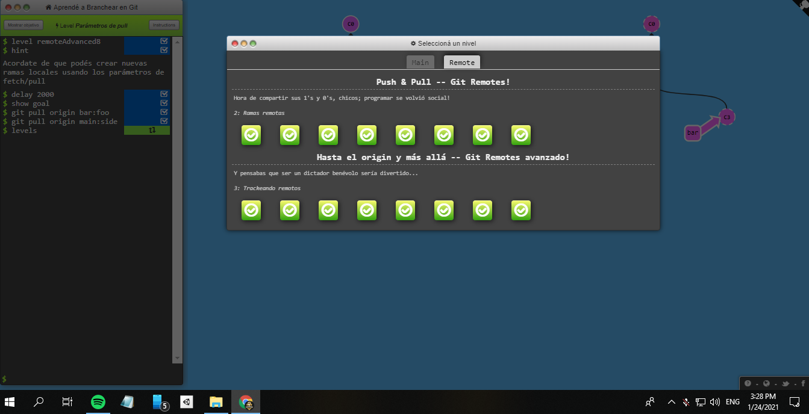

# Johann Cepeda
_Actualmente soy estudiante de ingeniería de sistemas en la Escuela Colombiana de Ingeniería Julio Garavito. Apasionado por el desarrollo de software._

### Hobbies :blush:

* Programar
* Videojuegos
* Leer sobre emprendimientos

### Roles :computer:

* Desarrollador Back-end
* Desarrollador Front-end (React)
* Desarrollador de Videojuegos 2D, 3D, AR.

### Git Branching
_Seccion **_main_** de GitBranching_

_Seccion **_remote_** de GitBranching_

_Encuentra este sistema de aprendizaje en:_
[GitBranch](https://learngitbranching.js.org/?locale=es_AR) :memo:

