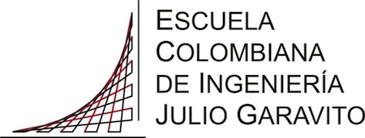

<h1 align="center"">A cerca de mí</h1>

```
 <script>
  
    alert( 'Hello, world!' );
    
 </script>

```

>
>
>                                                        Piensa, Actúa,Evalúa,Adáptate. Bill Gates
>
>

Mi nombre es *juan camilo* y tengo 21 años .\
Pertenezco al programa de ingenieria de sistemas de la [Escuela Colombiana de Ingenieria Julio Garavito](https://www.escuelaing.edu.co/es/) y estoy en ***Octavo semestre***

## Habilidades y fortalezas🚀

_Mis habilidades y fortalezas son:_
* Disciplina
* Liderazgo
* Responsabilidad
* Honestidad
* Integro
* Tolerante

### Pasatiempos 📋

_Mis pasatiempos son:_
1. Dibujar
2. Programar
3. Pintar
4. Jugar ajedrés.
5. Compartir con mi familia.
